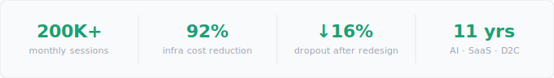
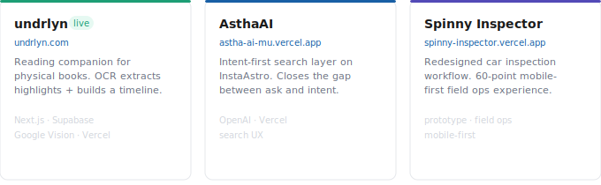
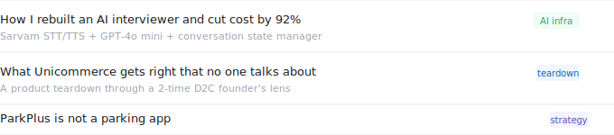

 

11 years across AI-native products, marketplaces, and D2C. Most recently — sole PM on an AI voice interview product at Saathi WorldApp. **200K+ sessions/month.** Rebuilt the architecture, cut infra cost by **92%**, dropped dropout from 28% → 16%. I work at the intersection of user problems and technical constraints — *where most PMs stop reading.*

 

---

## Building now

 

 

---

## Writing & point of view

 

 

---

[LinkedIn](https://linkedin.com/in/yadavsanjeet) · [undrlyn.com](https://undrlyn.com) · [sanju88ind@gmail.com](mailto:sanju88ind@gmail.com)
